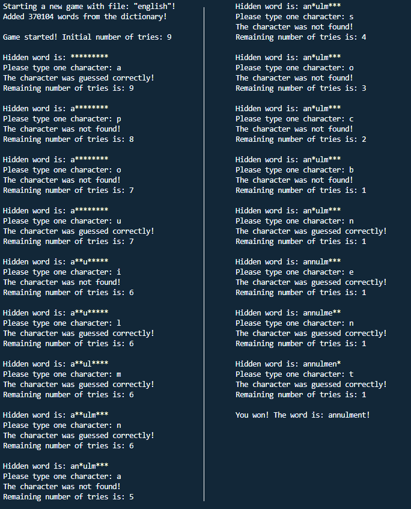

# word_guesser_game
A terminal game using C++ for guessing randomy picked words from a dictionary file.

To compile the code, run:
`g++ main.cpp sources/Game.cpp -o main`

To play the game, launch the __*main.exe*__ application and specify a dictionary file name.

Note that the dictionary files must be included in the __*dictionary*__ folder.

Example using the __*english*__ dictionary file:

